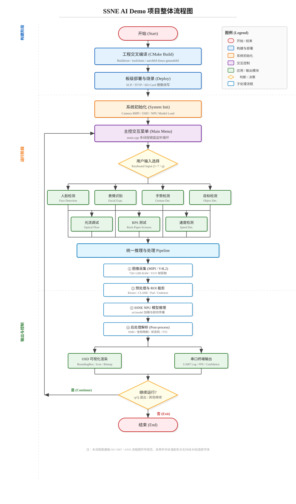

# 功能汇总

本目录（`main`）基于 SmartSens SC132GS A1 的 AI SDK 提供了一套涵盖8个核心应用演示的综合工程（ssne_ai_demo），接入了主控菜单。以下是对每个模块的具体功能、特色、可视化方案和上板结果的详细介绍。

## 1. 人脸检测 (Face Detection)
- **功能**: 支持实时的人脸检测任务，基于 `face_640x480.m1model` 模型。从 720×1280 分辨率视频流的中心区域截取出 720×540 画面后处理至 640×480 送入 SCRFD 网络。
- **特色**: 
  - 支持快捷键监听（多线程异步接收键盘指令），键入 `q/Q`即可动态退出人脸检测并返回主菜单；
  - 针对裁剪与原图的坐标系做了映射复原，在显示时保证了全屏幕显示的还原度。
- **可视化方案**: 利用 SSNE Visualizer 进行 OSD 数据渲染，包括人脸边界框的绘制，左上角同时轮播三种 `.ssbmp` 的位图形成简单的动画提示；同时在串口终端打印 `[FACE DETECTED]` 坐标和置信分数。
- **上板结果**: 运行流畅，能够准确捕捉多张人脸框，屏幕上带有连续动画反馈。

## 2. 面部表情识别 (Facial Expressions)
- **功能**: 专注于在固定 ROI （或人脸追踪区域）内捕捉用户表情，进行基于 `emotion_4class.m1model` 的实时 4 分类情绪识别。
- **特色**:
  - 定向截图优化，采用中心 640×640 的正方区域送入模型（输入分辨率224×224）；
  - 配备空指针判空的鲁棒机制，有效处理传感器异常帧。
- **可视化方案**: Visualizer OSD 模块结合 `shared_colorLUT.sscl` 色调进行渲染，在画面框出 Face ROI，并显示表示对应心情的状态图标。终端会实时打印当前确认情绪如 `[EMOTION] Happy (conf=...)`。
- **上板结果**: 表情分辨敏感度高，能实时追踪并显示 4 种主情绪概率。

## 3. 手势检测 (Gesture Detection)
- **功能**: 实现静态与动态手势（6种手势，例如 Palm, Ok 等）的分析。截取 640×640 ROI，并使用 `gesture.m1model` 在224分辨率上跑分类任务。
- **特色**:
  - **动态增强**: 内置 CLAHE（限制对比度自适应直方图均衡化）选项。支持通过键盘键入 `c/C` 开启/关闭实时的 CLAHE 算子以应对过亮过暗的苛刻光照条件；
- **可视化方案**: 在屏幕的指定手部检测区域画出指引框，实时可视化并显示预测结果；会在终端串口中实时输出 6 个类别的原始概率值 `Raw: [0]..[5]` 以及 `CLAHE: ON/OFF` 状态。
- **上板结果**: 分类精准度极高，切换不同手势有及时的置信度概率反馈，受背光影响时开启 CLAHE 有效提升识别率。

## 4. 目标检测 (Object Detection)
- **功能**: 使用 YOLOv8 架构 (`yolov8n_object_detection.m1model`) 的预训练网络执行全局的通用物体检测。
- **特色**:
  - 采用定制化的 `cls.yaml` 超轻量级字典匹配进行类别 ID 到类别字符串名的映射转换；
  - **完美比例还原**: 应用了精密的黑边填补（Pad）与反偏置算法，对 $1280/480 \approx 2.66$ 的缩放做了平滑处理，确保了 640x480 模型结果缩放回 1280 竖屏时的边界安全。
- **可视化方案**: 根据模型的 Boxes 绘制追踪框，叠加识别字符串及颜色。
- **上板结果**: 能在竖屏原比例中实时检测常见的类别且锚框精确对齐原图不畸变。

## 5. 光流调试 (Optical Flow Debug)
- **功能**: 实现双流或单目的运动障碍物光流避障系统（Optical Flow Obstacle Avoidance）。使用 FAST 角点探测结合 Lucas-Kanade 稀疏光流计算物体的运动。
- **特色**:
  - 不完全依赖深度学习，以传统经典视觉（720x540 ROI）为核心，计算散度 (Divergence) 和碰撞时间 (TTC, threshold=1.0) 预判障碍物逼近；
  - 提供多线程软控状态机，支持 `p/P` 随时暂停和继续处理。
- **可视化方案**: 检测环境中是否存在 `/dev/osd0` 驱动开启画中画可视化；能在屏幕上直接绘制跟踪的特征点角点线（Optical flow vector），并在碰撞预警发生时报警。
- **上板结果**: 显示密集的追踪角点线段流模式，当物体快速拉近时（TTC < 1.0），触发回避警报。

## 6. RPS测试 (RPS Detection)
- **功能**: 开发用于“剪刀石头布”（Rock-Paper-Scissors）游戏博弈的前摇预测程序（基于 `paper.m1model`）。
- **特色**:
  - 具有**前摇预测**的能力，能在用户的投掷动作完全凝固前对帧差运用时序状态机判定手势；
  - 优化推理管道，实现最高可达 90FPS 的高帧率实时推理；
  - 内置 AI 的 counter-play 博弈系统（判定用户动作后瞬间给出必定赢的指令）。
- **可视化方案**: 根据状态机的锁定信号 (`is_locked`)，将捕捉动作和对应的电脑AI反制动作通过 OSD 和串口展现，例如 `[GAME] Human: SCISSORS → AI plays: ROCK`。
- **上板结果**: FPS 响应极高，人眼根本无法捕捉 AI 的反应差，实现百战百胜。

## 7. 速度检测 (Speed Detection)
- **功能**: 用于道路车辆和移动载具（以缩微模型为主，包含CAR(7.1cm), TRUCK, BUS比例）的车速测算与实时追踪，跑在 `yolov8n_speed_detection.m1model` 上（推理尺寸 320x320）。
- **特色**:
  - 引入了**内参矩阵反畸变（UndistortPoint）**，包含基于相机参数 $f_x, f_y, c_x, c_y$ 和畸变系数 $k_1, k_2, k_3, p_1, p_2$ 的物理坐标映射校准；
  - 融合目标检测与车队时序追踪映射来计算真实相对移动速度 `smoothed_speed`，兼备抗抖计算；重点截取下半屏幕视角。
- **可视化方案**: 根据追踪到的物体 ID 返回车体，画出车距以及当前时速 (cm/s 级别)，提供直观的速度监控仪表。
- **上板结果**: 能稳定咬住进入监控区域的车辆，有效消除相机透视畸变引发的边缘速度跳变。

## 8. 追焦功能 (Focus Tracking)
- **功能**: 面向居家机器人和车载场景的单目灰度目标追踪聚焦。首版不依赖机械镜头马达，而是持续锁定高价值 ROI，输出目标框、中心偏差、置信度和清晰度评分。
- **特色**:
  - 使用轻量传统视觉完成高频追踪，预留低频 AI 目标选择器接口，适合向 90FPS 目标优化；
  - 支持 `p/P` 暂停、`r/R` 重置锁定、`q/Q` 返回主菜单；
  - 可作为后续云台控制、电子裁剪、目标检测 ROI 复用和车载关注区域选择的前级模块。
- **可视化方案**: OSD 绘制追焦目标框，串口终端输出 FPS、锁定状态、置信度、清晰度评分和中心偏差。
- **上板结果**: 已完成框架代码与菜单接入，下一步需要上板验证参数并按场景采集数据训练低频目标选择器。

---

## 项目整体流程图

下图展示了 `ssne_ai_demo` 从工程交叉编译、板级部署、系统初始化、主控菜单交互、八大 AI/视觉应用模块，到统一推理 Pipeline 与结果输出的完整项目流程。图中符号与配色遵循 **ISO 5807 / ANSI** 标准流程图规范：

- **圆角矩形**：表示流程的开始与结束；
- **矩形**：表示处理过程或操作步骤；
- **菱形**：表示判断或决策分支；
- **箭头流向**：统一采用自上而下、自左而右的顺序；
- **学术配色**：采用低饱和度的标准色阶（淡蓝、淡绿、淡橙、淡紫等）区分不同功能层级，确保在论文或技术文档中的可读性。

<p align="center">
  
</p>

---

## 📂 文件结构与功能总结

本 `main` 目录（包含下方子目录 `ssne_ai_demo`）的源码仓库总计构成 **40 个文件**。为了更直观地展现目录与归属边界，整体结构参照 `tree` 树状层级如下分布：

```text
main/
├── README.md                  # 本文档，汇集核心模块的配置梳理和成果图解说明
└── ssne_ai_demo/
    ├── main.cpp               # 程序的顶级主入口，提供主控交互菜单，管理全局状态以拉起八大应用
    ├── CMakeLists.txt         # CMake 构建的根级配置文件
    ├── app_assets/            # 静态视效和模型库
    │   ├── models/            # 存放 6 支核心算法所需的深度学习模型 (.m1model)
    │   ├── cls.yaml           # 供目标检测识别字符串匹配的轻量级字典
    │   └── *.ssbmp / *.sscl   # OSD 需使用的 UI 图像位图以及对应的主题色彩映射表
    ├── cmake_config/          
    │   └── Paths.cmake        # 负责管控依赖链接库和头文件的搜索路径
    ├── common/                # 公共基础组件代码 (避免各模块冗余)
    │   ├── include/           # 统一的基础封装头文件 (common.hpp, utils.hpp 等)
    │   └── src/               # 图像流水线(pipeline_image)、指针工具(utils)及主板显示驱动(osd-device)
    ├── modules/               # 核心算法业务应用模块目录
    │   ├── face_detection/    # [1] 人脸检测 
    │   ├── facial_expressions/# [2] 面部表情识别
    │   ├── gesture_detection/ # [3] 手势检测
    │   ├── object_detection/  # [4] 目标检测
    │   ├── optical_flow_debug/# [5] 光流调试与避障
    │   ├── rps_detection/     # [6] RPS 剪刀石头布预测
    │   ├── speed_detection/   # [7] 速度检测
    │   └── focus_tracking/    # [8] 追焦功能
    │   # （注：各业务子目录内均包含一个起衔接作用的 *_main.cpp 业务流入口，以及 src/ 引擎级前后处理解算文件）
    └── scripts/
        └── run.sh             # 最终板级的编译产物及环境依赖快速运行脚本，为了解除开机自启，这里没有内容仅做占位，后续可添加内容
```
